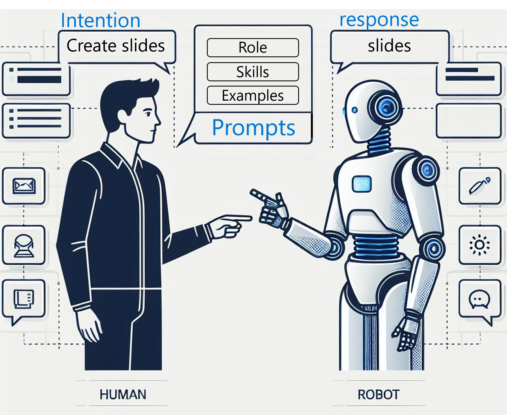
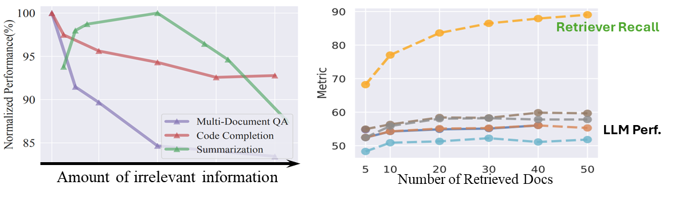
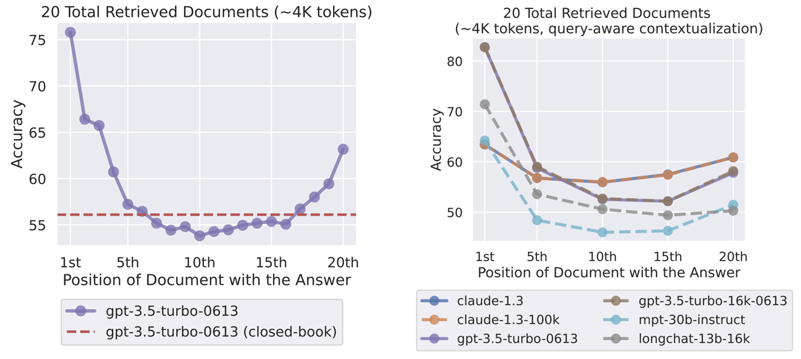
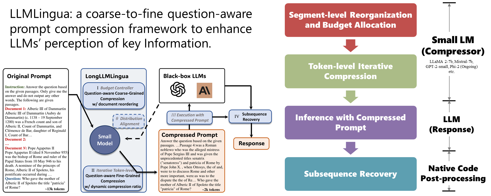
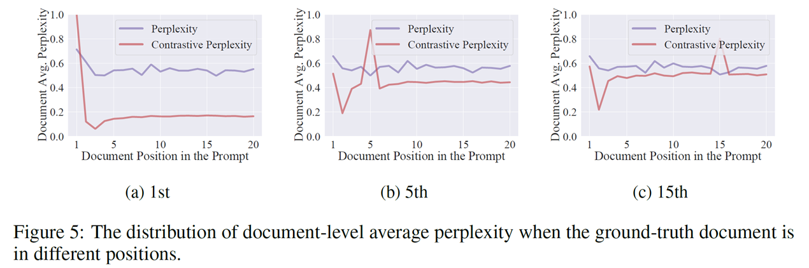
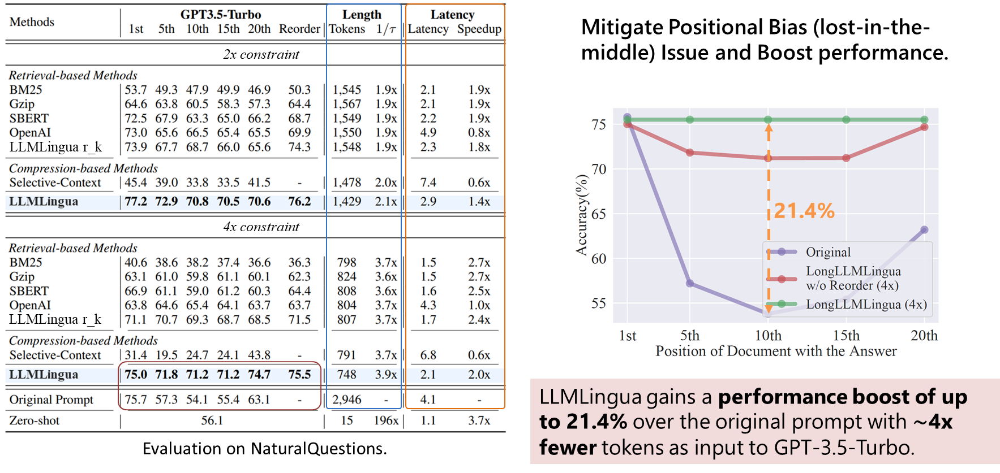
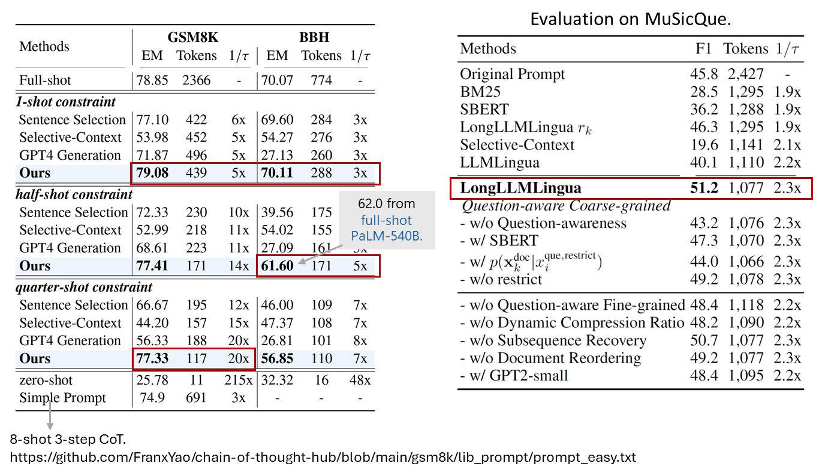
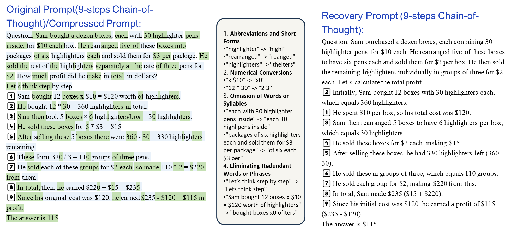
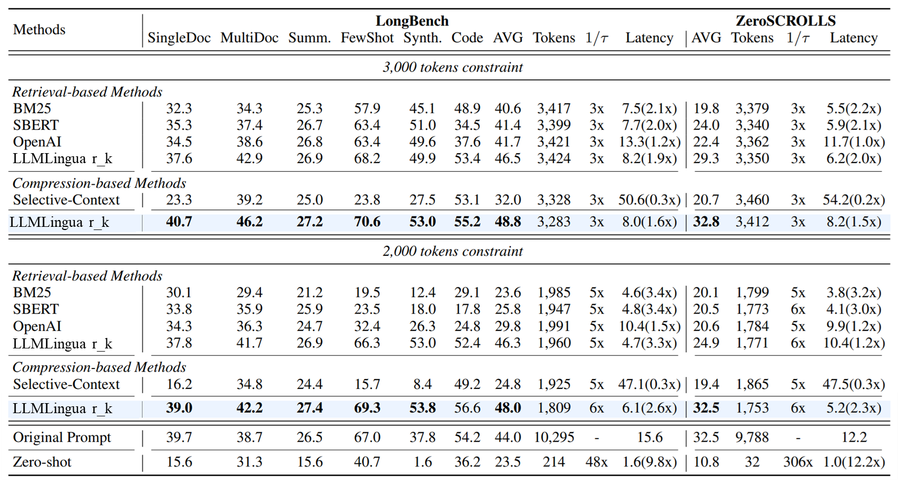

# Improving Communication from Humans to LLMs through LLMLingua

## Prompts: Bridging Human Intention and LLM

In the era of Large Language Models (LLMs), users articulate their requests to LLMs through natural language prompts, which serve as directives for the models to produce tailored responses. This communicative mechanism is pivotal for the functionality of AI tools such as the coding assistant Github Copilot and the self-directed AI entity AutoGPT.

Take, for example, Presentation Copilot, an AI designed to assist with creating presentation slides. A user looking to prepare for an upcoming presentation would express their needs to the Copilot using a prompt. This prompt might encompass a variety of elements, such as the Copilot's role (e.g., slide designer), specific commands or skills (e.g., editing slide content), illustrative examples, and a query containing details pertinent to the presentation's topic.

**LLM Performance Highly Depends on Prompts**

The quality of an LLM's output is contingent on prompts. We've witnessed the trend of longer and more sophisticated prompts because it can:

- Provide clearer, more specific instructions to LLMs
- Offer more contextual examples for the LLMs to follow
- Enhance relevant information retrieval in Retrieval Augmented Generation (RAG)
- Facilitate more in-depth conversations in Multi-Agent Conversations

Given its significance, we must consider the effectiveness and efficiency of information delivery through prompts from human to LLMs. In our imagination, all the words written in prompts should be caught by LLMs in a cheap cost and used to generate the desired output.
However, this is not the case in reality. In fact, the current state of human-LLM communication through prompts is far from ideal, thus affecting the quality of real-world LLM applications.
Now let's dive into the details of the challenges in human-LLM communication through prompts.

### Challenges in Human-to-LLM Communications
#### High costs associated with processing long prompts

A primary issue is the cost associated with prompt processing, which escalates with prompt length.

The computational complexity of processing inputs grows quadratically with prompt length, making longer prompts more resource-intensive.

#### Redundancy degrades the performance of LLM

Prompts often contain superfluous and irrelevant information, leading to distractions for the LLMs and resulting in subpar outputs.

Firstly, most of the prompts are manually written. Although guidance on writing effective prompts abounds, crafting the perfect prompt is still a challenging endeavor. To fully articulate their needs, users often include unnecessary and irrelevant content, such as unnecessary examples and details, but LLMs are easily distracted by these irrelevant information.

For example, in the left of the following figure (*source: [LongLLMLingua](https://arxiv.org/abs/2310.06839)*), LLM's performance degrade significant when given more irrelevant information in the prompt. In the right of the figure (*source: [lost-in-the-middle](https://arxiv.org/abs/2307.03172)*), we can see that the performance of LLMs saturates long before the retriever recall, indicating that the models have difficulty making use of the extra retrieved documents because of the irrelevant information in them.

Secondly, language is inherently redundant, especially in the scenarios of natural conversations, such as meeting transcripts. Therefore, prompts in such scenarios are likely to contain redundant and irrelevant information.

Finally, cases such as RAG and Multi-Agent Conversations are prone to introducing less relevant information into prompts. Particularly for RAG, the retrieved documents are recalled based on the text similarity. However, the text similarity is not always a good indicator of the relevance of the retrieved documents to the question. For example, the retrieved documents may contain the same words as the question, but the words are used in a different context. In this case, the retrieved documents are not relevant to the question, but the LLMs may still be distracted by the irrelevant information in the retrieved documents.

#### Positional bias that leads to selective information loss

LLMs, while sensitive to redundant and irrelevant information, also show a positional bias, meaning they are prone to missing information placed in certain parts of the prompt.

As shown in the following figure (*source: [lost-in-the-middle](https://arxiv.org/abs/2307.03172)*), the performance of LLMs degrades significantly when the relevant information is placed in the middle of the prompt (on the left of the figure). Even query-aware contextualization (placing the query before and after the documents, on the right of the figure) does not substantially mitigate this issue.

This kind of positional bias exists in a wide range of LLMs, as shown by the [Needle-in-a-Haystack](https://github.com/gkamradt/LLMTest_NeedleInAHaystack) experiment, even the most advanced LLMs like GPT-4-128K and Claude 2.1 (200K Tokens) are not immune to this issue (visualized as below, *source: [github.com/gkamradt](https://github.com/gkamradt/LLMTest_NeedleInAHaystack)*).

#### Summary of Challenges in Human-to-LLM Communications

The prompt serves as the pivotal communication channel between humans and LLMs, yet it is fraught with challenges:

- High costs associated with processing long prompts
- Redundancy and noise that degrade the quality of LLM outputs
- Positional bias that leads to selective information loss

## Enhancing Communication with LLMLingua

The challenges associated with suboptimal communication channels have been extensively documented across various fields. In information theory and communication, data compression and adaptive information flow techniques are employed to streamline machine-to-machine communication, thereby reducing transmission costs and optimizing for channel constraints.

In a parallel vein to the strategies applied to address imperfect information transmission in both wireless and wired communications, we present the **LLMLingua** series of works, a system crafted to elevate human-to-LLM communication through two key components:

- **Compression**: This entails the strategic removal of superfluous and tangential information from prompts, distilling the content to its essence.

- **Reorganization**: This step involves the thoughtful rearrangement of prompt content to counteract the LLM's positional bias, ensuring that critical information receives the appropriate attention.

With adoption of these techniques, we can enhance the efficiency and effectiveness of human-to-LLM communication, thereby improving the quality of LLM outputs.

- LLMLingua achieving up to 20x (ICL, ~Acc), 100+x (Online Meeting, ~Acc), 6x(Summarization, ~Acc).
- LLMLingua mitigate “lost in the middle” issue and improve up to 21.4% with only 1/4 of the tokens.
- Successfully integrated by [LlamaIndex](https://github.com/run-llama/llama_index/blob/286f2f7964db061f455641490d429a7a0dcf4622/llama_index/indices/postprocessor/longllmlingua.py), a widely used RAG framework.
- Summarized as an important module in Advanced RAG.
- Engaging in deeper collaboration with real-world applications.

### Architecture
Now let's dive into the architecture of our proposal to see how we achieve the above goals. The following diagram illustrates the overall structure of our approach, in which the *Gray Italicized* boxes are steps of LLMLingua (also shared by LongLLMLingua) while the others are only for LongLLMLingua.

Here is a brief description of each step:
1. **Coarse-Grained Reorganization**: Firstly we use a coarse-grained relevance measurement to identify the relevant segments of the prompt. After the relevant segments are identified, the segments are reorganized according to their relevance to the question and task to counteract the LLM's positional bias. Then we allocate a budget (compression ratio) to each segment according to its relevance. The budget is used in the next step to compress the prompt by removing the less relevant tokens.

2. **Token-Level Iterative Compression**: In this step, we use a fine-grained relevance measurement to identify the relevant tokens within each segment. Then we iteratively remove the less relevant tokens until the budget is exhausted. The fine-grained relevance measurement is based on the Pointwise Mutual Information (PMI) between the token and the question/task.

3. **Execution**: After the prompt is compressed and reorganized, it is fed into the LLM for execution.

4. **Recovery**: The output of the LLM is then translated back from compressed domain (if any) to the plaintext domain. This recovery step is on demand and only used when the output needs to be translated back to the original prompt. This method relies on the subsequence relationship among tokens in the original prompt, compressed prompt, and LLMs' response.

#### Relevance Measurement: The Foundation of Optimization

Both the coarse-grained and fine-grained relevance measurements are based on the perplexity of the token given the context. The perplexity is calculated by a Small-scale Language Model (SLM) (*e.g.*, LLAMA 7B).
The perplexity of a token or sequence given the context is a measure of how likely the token or sequence is to appear in the context. The lower the perplexity, the more likely the token is to appear in the context. Therefore, the perplexity can be used as a measure of relevance.

##### Understanding Perplexity

For those new to the concept of perplexity, it is a measurement used in natural language processing to quantify how well a probability model predicts a sample. A lower perplexity indicates a better prediction.

Given a token $x_i$ from a sequence $X=(x_0, \ldots, x_n)$, where each $x_{k=0..n}$ belongs to the vocabulary $\mathcal{V}$, the perplexity of $x_i$ given the preceding tokens $x_{<i}$ is defined as:

$$
\text{PPL}(x_i | x_{<i}) := 2^{H_{CE}(x_i | x_{<i})}
$$

Here, $H_{CE}(x_i | x_{<i})$ represents the Cross Entropy between the predicted distribution $p_\theta$ from the language model $\theta$ and the ground-truth distribution $q_i$ for the token $x_i$:

$$
H_{CE}(x_i | x_{<i}) := - \sum_{v\sim\mathcal{V}} q_i(v)\log p_\theta(v|x_{<i}) = - \log p_\theta(x_i|x_{<i})
$$

The simplification of the cross-entropy term is due to the one-hot nature of the ground-truth distribution $q_i$:

$$
q_i(v) = \begin{cases}
1 & \text{if } v = x_i \\
0 & \text{otherwise}
\end{cases}
$$

Thus, the log perplexity $\text{LP}(x_i | x_{<i})$ of the token $x_i$ is:

$$
\text{LP}(x_i | x_{<i}) := \log_2 \text{PPL}(x_i | x_{<i}) = - \log p_\theta(x_i|x_{<i})
$$

Extending this concept to a sequence $X$, the perplexity given a context $C$ (the tokens before $X$) is:

$$
\text{LP}(X|C) := \frac{1}{n} \sum_{i=0}^n \text{LP}(x_i | C, x_{<i}) = - \frac{1}{n} \sum_{i=0}^n \log p_\theta(x_i|C, x_{<i})
$$

The sequence perplexity is the average log perplexity across all tokens in the sequence, reflecting how well the language model predicts each token in its context. This concept is crucial in the computation of perplexity as detailed in the [Hugging Face documentation](https://huggingface.co/docs/transformers/perplexity).

#### Coarse-Grained Relevance Measurement

This approach assesses relevance at a broader level, considering larger segments of the prompt for their informational value relative to the user's query or task. Here segments can be paragraphs, sentences, demonstrations (examples) in Few-Shot learning tasks, or even documents in multi-doc Q&A task.

For a prompt composed as below:

$$
X = (I, S_1, \ldots, S_K, Q)
$$

where $I$ is the instruction, $S_k$ is the $k$-th segment, and $Q$ is the question (query) or task, we can quantify the relevance $r_k$ of each segment $S_k$ to the question or task $Q$ using the following formula:

$$
r_k := -\text{LP}(Q, R | S_k)
$$

where $R$ denotes a restrictive statement that trigger the SLM to predict the relevance of the segment $S_k$ to the question or task $Q$. Particularly, we use "*We can get the answer to this question in the given documents*" in LongLLMLingua. Of course, other statements like "The answer to the question is in the segment" or "The segment is relevant to the task" may also work.

#### Fine-Grained (Token-Level) Relevance Measurement

Building on the principles of the [Pointwise Mutual Information (PMI)](https://en.wikipedia.org/wiki/Pointwise_mutual_information), a statistical measurement of association within the realms of [probability theory](https://en.wikipedia.org/wiki/Probability_theory) and [information theory](https://en.wikipedia.org/wiki/Information_theory), we introduce a token-level relevance metric.

For a given token $x_i$ within the prompt sequence $X=(x_0, \ldots, x_n)$, we can quantify its relevance to a specific task or query, represented by $Q$, using the following formula:

$$
\begin{aligned}
s_i &:= \text{LP}(x_i | x_{<i}) - \text{LP}(x_i | Q, x_{<i}) \\
&= \log \frac{p_\theta(x_i | Q, x_{<i})}{p_\theta(x_i | x_{<i})} \\
&= \text{PMI}(x_i; Q | x_{<i})
\end{aligned}
$$

where $\text{PMI}$ represents the [Pointwise Mutual Information](https://en.wikipedia.org/wiki/Pointwise_mutual_information), a statistical measurement of association within the realms of probability and information theory, defined as below:

$$
\text{PMI}(a;b) := \log\frac{p(a,b)}{p(a)p(b)}=\log\frac{p(b|a)}{p(b)}
$$

As shown in the following figure (*source: [LongLLMLingua](https://arxiv.org/abs/2310.06839)*), the contrastive perplexity can effectively identify the relevant tokens in the prompt (the peak of contrastive perplexity follows the answer's position changes).

Through this fine-grained analysis, we can discern the relevance of individual tokens and make informed decisions about which elements to compress or reposition, thereby enhancing the overall clarity and efficiency of the prompt.

## Evaluation and Case Study

Firstly we evaluate the performance of LLMLingua on the Multi-Document Question Answering task as below. It can perfectly mitigate the "lost in the middle" issue and improve up to 21.4% with only 1/4 of the tokens.

The following show LLMLingua's performance on the math and reasoning tasks.

To gain a deeper insight into the effects of token-level compression, the following figure visualizes the tokens retained (highlighted in green on the left) and those discarded (displayed with a light-blue background on the left). In the center of this illustration, we've encapsulated four types of phenomena that LLMLingua employs to compress the prompt. On the right side of the figure, it is evident that GPT models can almost perfectly reconstruct the original prompt from the compressed version.

And here is the performance of LLMLingua on the more tasks and datasets. Interested readers can refer to the [paper](https://arxiv.org/abs/2310.06839) for more details.

## References
- LLMLingua Project Pages
  - [Homepage](https://llmlingua.com/),
  - LLMLingua: [EMNLP'23](https://aclanthology.org/2023.emnlp-main.825.pdf), [Github](https://github.com/microsoft/LLMLingua), [Demo](https://huggingface.co/spaces/microsoft/LLMLingua),
  - LongLLMLingua: [Arxiv](https://arxiv.org/abs/2310.06839), [Github](https://github.com/microsoft/LLMLingua/blob/main/examples/RAG.ipynb)
- Lost in the Middle: How Language Models Use Long Contexts, [Arxiv](https://arxiv.org/abs/2307.03172)
- Large Language Models Can Be Easily Distracted by Irrelevant Context, [Arxiv](https://arxiv.org/abs/2302.00093)
